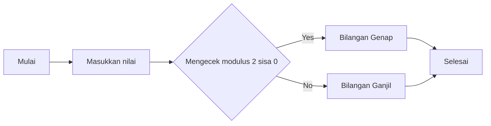

# Algoritma

## Algoritma Deskriptif

### Menentukan Bilangan Ganjil atau Genap

```
1. Mulai
2. Masukkan angka
3. Cek bilangan apakah sisa bagi 0 jika dibagi 2
4. Jika iya berarti bilangan tersebut genap
5. dan sebaliknya bilangan tersebut ganjil
6. Selesai
```

## Algoritma Flowchart

### Flowchart Bilangan Ganjil atau Genap


