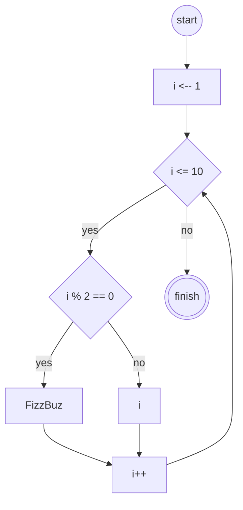

# Algoritma

## Flowchart



## Pseudocode

```pseudocode
    DECLARE i : INT
    DECLARE hasil : STRING

    hasil <-- "FizzBuzz"

    FOR i <- 1 TO 10
        IF i % 2 == 0 THEN
            OUTPUT, hasil
        ELSE
            OUTPUT, i
        ENDIF
    NEXT i
```
