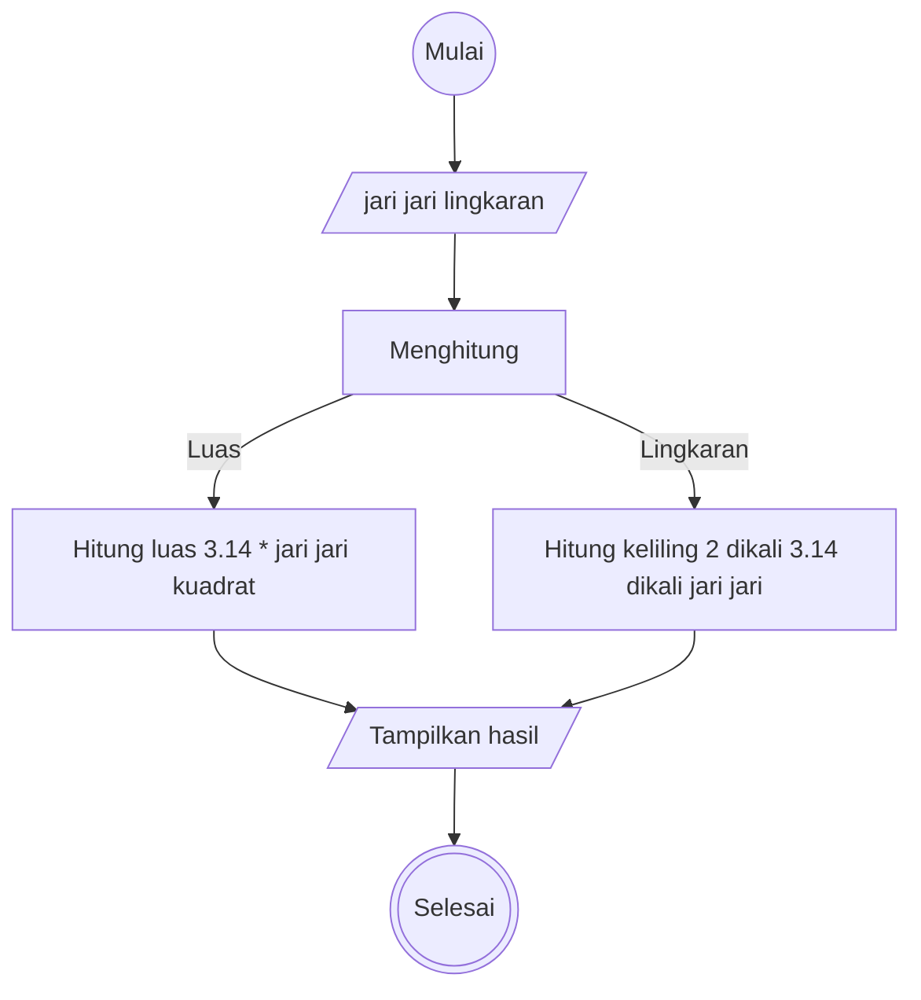

# Algoritma

## Algoritma Deskriptif

### Algoritma menghitung luas dan keliling lingkaran

```
1. Mulai
2. Masukkan sebuah angka sebagai jari jari lingkaran
3. Jika jari jari habis dibagi 7, maka gunakan pi sebagai 22/7
4. Jika tidak, gunakan pi sebagai 3.14
5. Hitung luas dengan pi dikali jari jari kuadrat
6. Tampilkan hasil hitung luas
7. Hitung keliling dengan 2 dikali pi dikali jari jari
8. Tampilkan hasil hitung keliling
9. Selesai
```

## Algoritma Flowchart

### Flowchart menghitung luas dan keliling lingkaran


